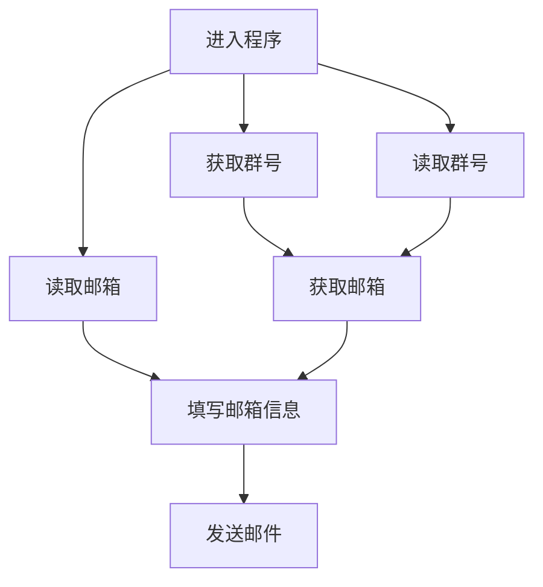

## 需求概述

- [x] 1. 通python爬取群成员qq，转化成邮箱，用以发送邮件
- [x] 2、发送邮件出了文字外，需支持附件和图片的发送，(附件可以发送一份，图片需支持发送多张)

  - [x] 发送文字
  - [x] 发送附件
  - [x] 发送图片
  - [x] text2html

- [x] 3、发送的邮件，需要在对方的收件箱而不是垃圾箱
- [x] 4、发送邮件的qq不一定是爬取群成员的qq
- [x] 5、支持多个进程多开同时发送

  - 目前已支持, 暂未测试(存在计数问题)

- [x] 6、发送完成之后显示发送成功提醒语，若发送失败或者错误，也请提示。

  - [x] 目前有提示(更改为弹窗+log的形式)
  - 部分流程暂未添加log和弹窗

- [x] 7、至少能保证连续运行至发送完当天爬取的所有邮箱

  - 要求20w/day

- [x] 8、提供发送其他类型邮箱的接口比如163，126等，我这边儿提供比如163邮箱的txt等文本文件(支持json格式)
  - [x] 支持163邮箱发送
  - [x] 支持126邮箱发送

