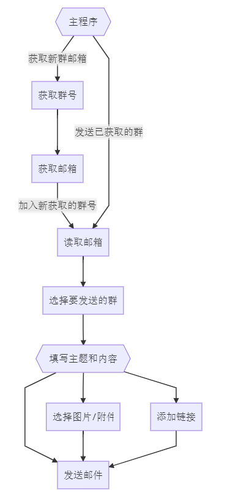

# QQ group member mail sender

## 使用教程



## 更新日志

- 10.26
  > 增加群号列表可选择
  > 增加显示发送邮件进度条
  > 提高程序易用性
- 10.27
  > 固定窗口大小
  > 固定窗口位置到屏幕正中

## 特性简介

- 自动获取所有群号
- 支持qq,126,163邮箱发送
- 多线程批量发送邮件(需自己提供账号)
- 自由选择接收人
- 邮件支持多张图片及一个附件
- 反垃圾邮件机制
- 反检测群成员获取机制
- 反封号机制

## 注意事项

文件当前目录下需要有对应Chrome版本的[chromedriver](https://npm.taobao.org/mirrors/chromedriver/)
文件当前目录需要有自己提供的account.json

```json
{
  "qq":[
    {"email":"123456789@qq.com",
      "auth":"xxxxxxxxxxxxxx"
    }
  ],
  "126":[
    {"email":"123456789@126.com",
      "auth":"xxxxxxxxxxxxxx"
    }
  ],
  "163":[
    {"email":"123456789@163.com",
      "auth":"xxxxxxxxxxxxxx"
    }
  ]
}
```

## 需求概述

- [x] 1. 通python获取群成员qq，转化成邮箱，用以发送邮件
- [x] 2、发送邮件出了文字外，需支持附件和图片的发送，(附件可以发送一份，图片需支持发送多张)

  - [x] 发送文字
  - [x] 发送附件
  - [x] 发送图片
  - [x] text2html

- [x] 3、发送的邮件，需要在对方的收件箱而不是垃圾箱
- [x] 4、发送邮件的qq不一定是获取群成员的qq
- [x] 5、支持多个进程多开同时发送

  - 目前已支持, 暂未测试(存在计数问题)

- [x] 6、发送完成之后显示发送成功提醒语，若发送失败或者错误，也请提示。

  - [x] 目前有提示(更改为弹窗+log的形式)
  - 部分流程暂未添加log和弹窗

- [x] 7、至少能保证连续运行至发送完当天获取的所有邮箱

  - 要求20w/day

- [x] 8、提供发送其他类型邮箱的接口比如163，126等，我这边儿提供比如163邮箱的txt等文本文件(支持json格式)
  - [x] 支持163邮箱发送
  - [x] 支持126邮箱发送